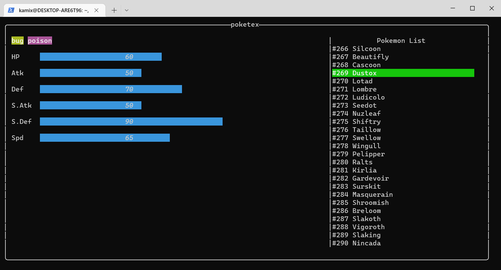

# Poketex

A simple pokedex tui

data generated from [ckaznable/poke-data-crawler](https://github.com/ckaznable/poke-data-cralwer)

## Using

🚧 WIP

## Todo

- [x] show pokemon iv and type
- [ ] make pokemon table searchable
- [x] add region form
  - [x] Alola
  - [x] Galar
  - [x] Hisuian
  - [x] Paldea
- [ ] add cli variable