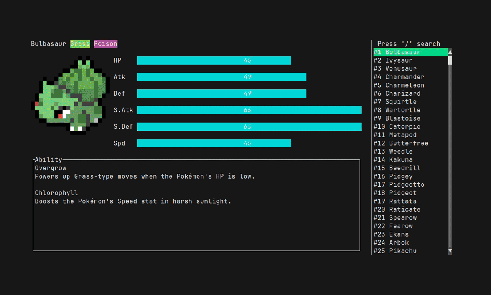

<h1 align="center">
  📖 Poketex
</h1>

<p align="center">
  Simple Pokedex based on TUI(Terminal User Interface)
</p>

<p align="center">
  
  
  
</p>



## Table of Contents

- [Feature](#feature)
- [Installation](#installation)
  - [Install from Github Release](#install-from-github-release)
  - [Install from crates.io](#install-from-cratesio)
  - [Install from the AUR](#install-from-the-aur)
  - [Install from Source Code](#install-from_source-code)
- [Usage](#usage)
- [Keyboard Navigation Instructions](#keyboard-navigation-instructions)
- [Roadmap](#roadmap)
- [Troubleshoot](#troubleshoot)
- [Pokemon data source](#pokemon-data-source)
- [License](#license)

## Feature

1. All Pokemon (until Pokemon SV)
2. All Region Form (until Pokemon SV)
3. Searchable
4. include English, Chinese, Japanese locales data

## Installation

### Install from Github Release

Download the last version binary depending on your configuration here: [Release Page](https://github.com/ckaznable/poketex/releases/latest)

Then you just need to enter this command in your terminal:

```shell
tar -xf <downloaded_archive> poketext && sudo mv poketext /usr/local/bin
```

### Install from crates.io

If you're a Rust programmer, poketex can be installed with cargo.

```shell
cargo install poketex
```

### Install from the AUR

If you're using Arch Linux, you can install poketex with using an [AUR helper](https://wiki.archlinux.org/title/AUR_helpers). For example:

```shell
paru -S poketex
```

### Install from Source Code

poketex is written in Rust, so you'll need to grab a [Rust installation](https://www.rust-lang.org/) in order to compile it.

```shell
git clone https://github.com/ckaznable/poketex
cd poketex
make build
sudo make install
```

If you want to uninstall

```shell
sudo make uninsall
```

## Usage

```shell
Usage: poketex [OPTIONS]

Options:
  -l, --locale <LOCALE>  locales [zh, ja, en] [default: en]
  -h, --help             Print help
  -V, --version          Print version
```

## Keyboard Navigation Instructions

Use arrow keys or `hjkl` to move around.

Press `Page Up` or `Page Down` to move 4 steps at a time.

Press `q` to exit.

Press `H` to display help information.

Press `gg` to go to the top and `G` to go to the bottom.

Press `alt+j` or `alt+k` to scroll up or down ability description.

Press `/` to enter search mode.

## RoadMap

- [x] show pokemon iv and type
- [x] pokemon list searchable
- [x] add pokemon ability rows
- [x] add region form
  - [x] Alola
  - [x] Galar
  - [x] Hisuian
  - [x] Paldea
- [x] add cli variable
  - [x] --locale [en, ja, zh]
- [x] help key
- [x] gen 9 DLC - The Teal Mask
- [x] gen 9 DLC - The Indigo Disk
- [x] Image support (powered by [pokemon-colorscripts](https://gitlab.com/phoneybadger/pokemon-colorscripts))

## Troubleshoot

### Image are not displaying

If the ansi images are not displaying, please copy the `colorscripts` folder from this repository to `/usr/local/share/poketex`.

```shell
git clone https://github.com/ckaznable/poketex
cd poketex
mkdir -p /usr/local/share/poketex/colorscripts
cp -rf colorscripts /usr/local/share/poketex
```

## Pokemon data source

data generated from [ckaznable/poke-data-crawler](https://github.com/ckaznable/poke-data-cralwer)

## License

[MIT](./LICENSE)
